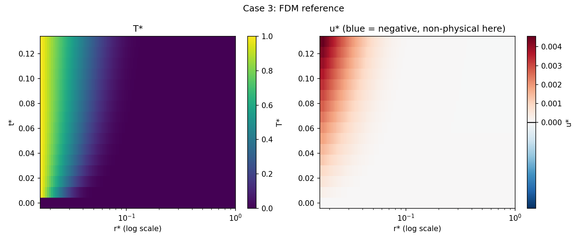
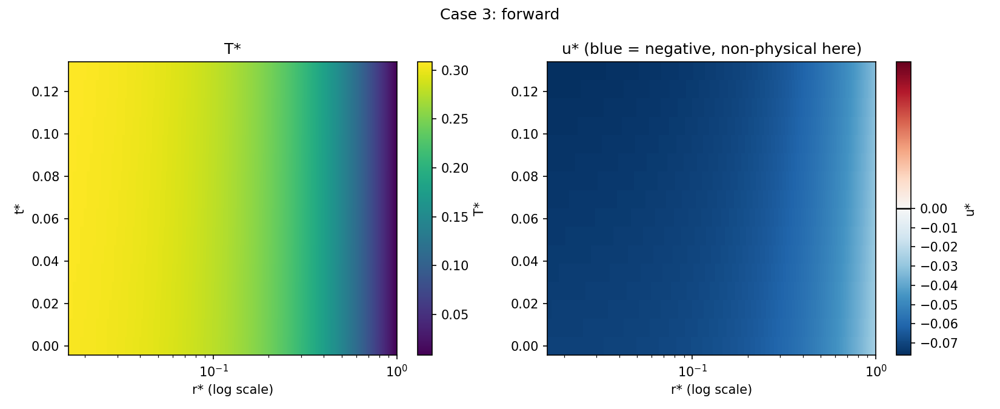
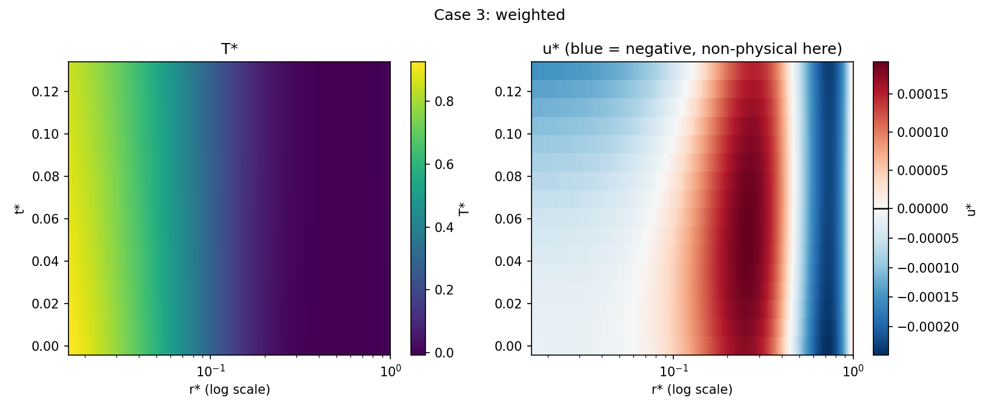
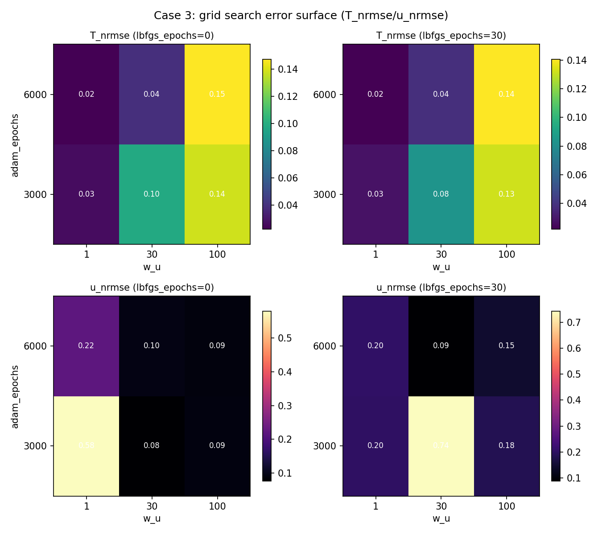
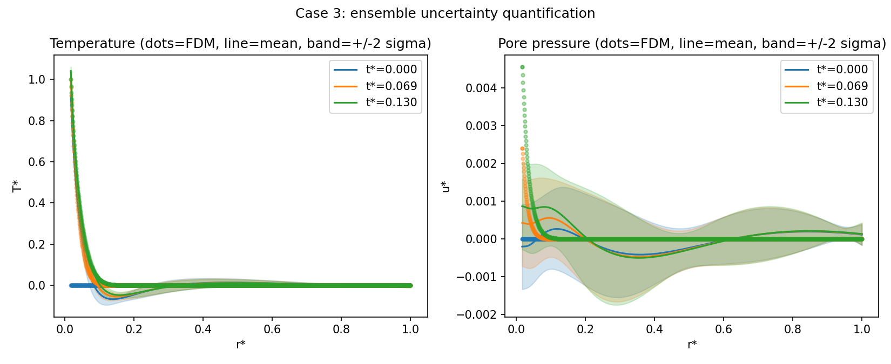
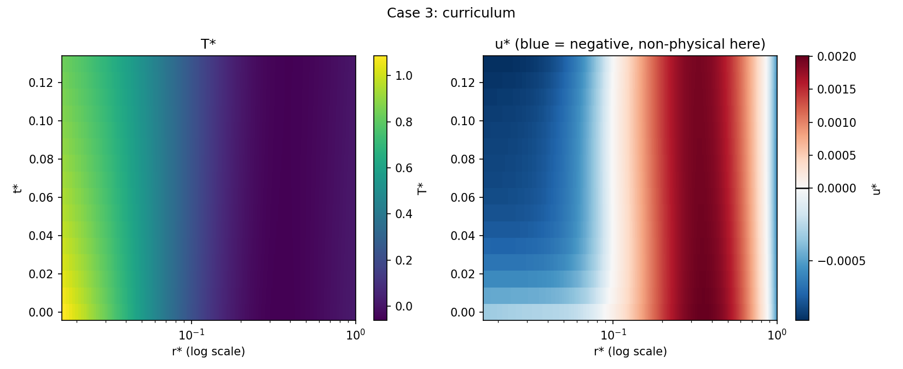

# Task 2 -- Forward PINN: Summary Report

All numbers and figures below come from `data/processed/` (FDM case 3,
k=1e-10) and are reproducible via the scripts in `scripts/` (`train.py`,
`compare_variants.py`, `grid_search.py`, `ensemble.py`, `curriculum.py`).

## Contents

- [Objective](#objective)
- [Nondimensionalization (Task 1)](#nondimensionalization-task-1)
- [Architecture v1: a single shared network](#architecture-v1-a-single-shared-network)
- [The problem we found](#the-problem-we-found)
- [Diagnostic methodology](#diagnostic-methodology)
- [Grid search results](#grid-search-results)
- [Extra validation techniques](#extra-validation-techniques)
- [Architecture search](#architecture-search)
- [Uncertainty quantification (deep ensemble)](#uncertainty-quantification-deep-ensemble)
- [Curriculum learning experiment](#curriculum-learning-experiment-negative-result)
- [The bigger picture: architecture beats tuning](#the-bigger-picture-architecture-beats-tuning)
- [What carries over](#what-carries-over-regardless-of-final-architecture)
- [Recommendation](#recommendation--next-steps)

---

## Objective

Solve the coupled heat conduction + pore-pressure PDE system for a
geothermal pile (Fuentes et al., 2016) with a Physics-Informed Neural
Network. Task 2's constraint: only initial and boundary conditions may
be used as supervised loss terms -- **no labeled data from the interior
of the domain**. Target case: `Tf = 50 C`, `Ts = 12 C`.

## Nondimensionalization (Task 1)

The governing equations are rewritten in dimensionless form:
`r* = r/R_s`, `t* = t/t_c`, `T* = (T-Ts)/(Tf-Ts)`, `u* = u/u_c`. This
produces three coefficients (`C1`, `C2`, `C3`) that fully capture the
physics for a given permeability `k` and soil compressibility `Ks`.
Centralized in `PhysicsConstants.calculate_physics_constants()` -- a
single source of truth reused by every experiment below.

## Architecture v1: a single shared network

The first (and simplest) design: one MLP (`GeothermalPINN`) with two
outputs, `T*` and `u*`. Loss = PDE residual + IC loss + BC loss (pile +
far-field), trained with Adam and optionally fine-tuned with L-BFGS.

| FDM reference | Initial PINN result |
|---|---|
|  |  |

## The problem we found

`T*` is O(1); `u*` is O(1e-3) -- three orders of magnitude apart. An
equal-weight MSE loss lets the temperature term dominate the gradient,
so the network barely gets a signal to fit `u*` correctly. The visible
symptom: predicted `u*` goes **negative** in parts of the domain --
physically meaningless, since excess pore pressure only builds up while
heating (Fuentes et al., 2016). That's a clear sign of a training
pathology, not something "more epochs" fixes on its own.

*(diverging colormap -- blue region is non-physical negative pressure)*

## Diagnostic methodology

Rather than guessing at a fix, we ran controlled ablations:

1. **Loss reweighting** (`w_u`): scanned `w_u in {1, 30, 100}`.
2. **Training length**: scanned `adam_epochs in {3000, 6000}`.
3. **L-BFGS fine-tuning**: scanned `lbfgs_epochs in {0, 30}`.
4. Full grid = 12 combinations, all trained on identical, seeded
   collocation points, so differences are attributable only to the
   hyperparameter under test.

We also introduced a second metric alongside relative L2 error:
**NRMSE** (RMSE normalized by the field's own max magnitude). Relative
L2 (`||pred-true|| / ||true||`) inflates dramatically for a field like
`u*` that is close to zero almost everywhere except near the pile --
NRMSE doesn't have that pathology and better reflects real fit quality.

## Grid search results

| w_u | adam_epochs | lbfgs_epochs | T_nrmse | u_nrmse |
|---|---|---|---|---|
| 1 | 6000 | 30 | 0.022 | 0.204 |
| **30** | **6000** | **30** | **0.038** | **0.088** |
| 100 | 6000 | 30 | 0.141 | 0.145 |

Best combination: **w_u=30, adam_epochs=6000, lbfgs_epochs=30**. Uniform
weighting (`w_u=1`) gives the best `T*` alone but much worse `u*`;
heavy weighting (`w_u=100`) overcorrects and hurts `T*` badly.

One data point (`w_u=30, adam_epochs=3000, lbfgs_epochs=30`) looked
deceptively promising on an early, cluttered comparison chart, but was
actually the **worst** result in the entire grid (`u_nrmse=0.74`) --
L-BFGS overshooting an under-converged 3000-epoch run. 

## Extra validation techniques

Two additions that make the results more defensible, not just more
accurate:

1. **Physical constraint** -- a soft penalty (`relu(-u*)^2`) added to
   the loss so the network is explicitly discouraged from predicting
   negative `u*`, directly targeting the artifact found above.
2. **Physics-recovery check** -- the PDE residual computed on the FDM
   reference grid (points never used as *training* collocation points).
   A residual still near zero there is independent evidence the network
   learned the physics, not just the boundary targets. Reported
   alongside every result, e.g. for the ensemble below:
   `T_pde_residual_rms=0.041`, `u_pde_residual_rms=0.0006`.

## Architecture search

Tested whether the network's *shape* matters, holding the best
hyperparameters fixed:

| architecture | T_nrmse | u_nrmse | combined |
|---|---|---|---|
| **64x6 (uniform, default)** | 0.038 | **0.088** | **0.126** (best) |
| 128x4 (wide, shallow) | 0.043 | 0.094 | 0.137 |
| 32x10 (narrow, deep) | 0.030 | 0.137 | 0.167 |
| "hourglass" (128-64-32-32-64-128) | 0.102 | 0.289 | 0.391 (worst) |

The default uniform architecture won overall. Hourglass shapes
performed worst -- the narrow middle layers likely bottleneck the
network's ability to represent the sharp near-pile gradient.

## Uncertainty quantification (deep ensemble)

Trained 5 independently-seeded models at the best hyperparameters and
combined predictions into a mean +/- standard deviation.

Point accuracy **improved over the single best model**:
`u_nrmse` 0.088 -> **0.0735**.

Calibration (does the stated uncertainty match the real error?):

| | 1-sigma coverage (want ~0.68) | 2-sigma coverage (want ~0.95) |
|---|---|---|
| u* | **0.695** | **0.952** |
| T* | 0.382 (overconfident) | 0.818 (overconfident) |

`u*` uncertainty is genuinely well-calibrated -- trustworthy confidence
intervals for the quantity that matters most physically. `T*` is
overconfident, an honest limitation worth stating rather than hiding.

## Curriculum learning experiment (negative result)

Hypothesis: ramping `w_u` up in stages (1 -> 10 -> 30) instead of
fixing it might converge better, motivated by the same T*/u* imbalance
diagnosis. Tested with the same total training budget as the best
fixed-weight run (6000 Adam + 30 L-BFGS epochs), for a fair comparison.

| | T_nrmse | u_nrmse |
|---|---|---|
| Fixed weight (best combo) | 0.038 | 0.088 |
| Staged curriculum (same budget) | 0.110 | 0.276 |

Result: the curriculum **did not beat** the fixed-weight baseline.
Reported as-is -- a properly controlled experiment that disproves a
reasonable hypothesis is still good methodology.

## The bigger picture: architecture beats tuning

Best result from this shared-network approach, after full
hyperparameter search + architecture search + ensembling:
**`u_rel_l2 ~= 130%`**.

An alternative design -- **two decoupled networks** (temperature solved
once, independently, since the heat equation doesn't depend on
permeability; pressure network trained per-case using the temperature
network's time-derivative as a fixed source term) reaches **`u_rel_l2 ~= 12%`**.

The governing equations have a **one-way coupling**
(temperature affects pressure, not vice versa). A single shared network
has no way to exploit that; decoupling removes the entire
gradient-competition problem instead of patching around it with loss
weights.

This is the key finding of the whole exercise: no amount of loss
weighting, architecture search, or ensembling closes a 10x gap that
comes from a structural modeling choice.